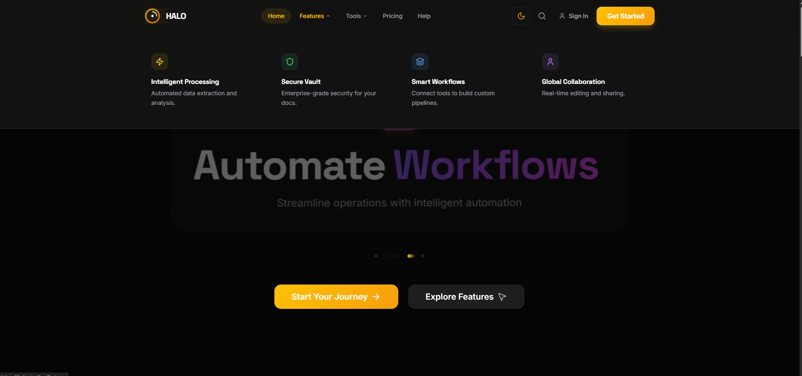
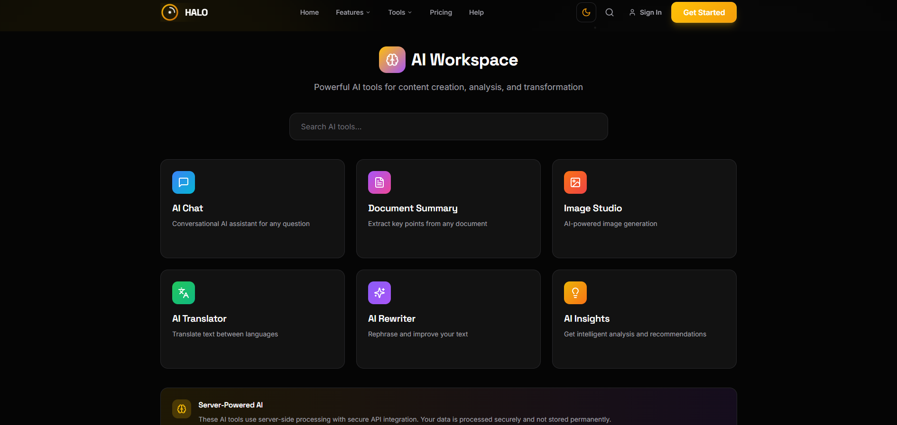
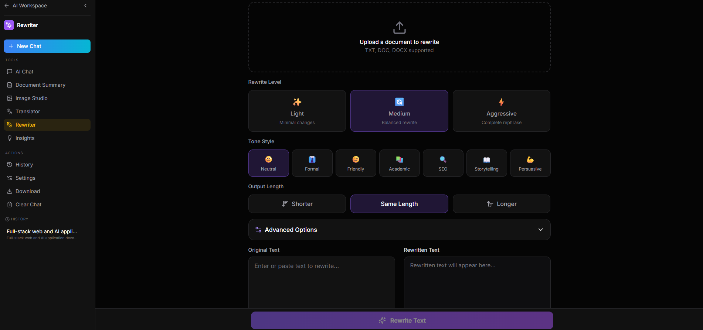

<div align="center">

# HALO Docs AI

### Enterprise-Grade AI Document Processing & Automation Platform

[](https://nextjs.org/)
[](https://fastapi.tiangolo.com/)
[](https://www.typescriptlang.org/)
[](https://python.org/)
[](https://react.dev/)
[](https://postgresql.org/)
[](https://redis.io/)
[](https://docker.com/)
[](https://cloud.google.com/)
[](LICENSE)

**A full-stack SaaS platform featuring 30+ document processing tools, 6 AI-powered workspaces, real-time streaming responses, and cloud-native deployment architecture.**

[Features](#-features) • [Demo](#-demo-video) • [Screenshots](#-screenshots) • [Installation](#-installation) • [Architecture](#%EF%B8%8F-system-architecture)

</div>

---

## 📋 Overview

**HALO Docs AI** is a production-ready, enterprise-grade document processing platform that I designed and built to solve real-world challenges in document automation and AI-powered content transformation. The platform processes PDFs, Office documents, images, and media files while leveraging Google's Gemini AI for intelligent document analysis, summarization, translation, and content generation.

This project demonstrates my expertise in building scalable full-stack applications with modern technologies, implementing complex AI integrations, designing intuitive user experiences, and architecting cloud-native solutions that can handle production workloads.

**Key Business Impact:**
- **30+ document tools** reducing manual document processing time by up to 80%
- **AI-powered automation** enabling intelligent content extraction and transformation
- **Real-time streaming** delivering instant feedback for large document operations
- **Cloud-native architecture** supporting horizontal scaling and high availability

---

<div align="center">

## 🎬 Demo Video

https://github.com/user-attachments/assets/demo.mp4

*Full platform walkthrough demonstrating AI workspace, document tools, and real-time processing*

**[▶️ Watch Full Demo](assets/videos/demo.mp4)**

</div>

---

## 📸 Screenshots

<div align="center">

### Homepage & Hero Section
*Modern, animated landing page with 3D elements and smooth scroll interactions*



<br/><br/>

### AI Workspace Dashboard
*Comprehensive AI tool suite with 6 specialized workspaces for content creation and analysis*



<br/><br/>

### AI Rewriter Tool
*Advanced text transformation with multiple tone styles, rewrite levels, and length controls*



</div>

---

## ✨ Features

### 🤖 AI Workspace (6 Intelligent Tools)

| Tool | Capabilities |
|------|--------------|
| **AI Chat** | Conversational AI assistant with personality modes, conversation history, and streaming responses |
| **Document Summary** | Extract key points, generate executive summaries from PDF, DOC, TXT files |
| **Image Studio** | AI-powered image generation, analysis, and transformation using Gemini Vision |
| **AI Translator** | Multi-language document translation with context preservation |
| **AI Rewriter** | Content rephrasing with tone control (Formal, Friendly, Academic, SEO, Persuasive) |
| **AI Insights** | Intelligent analysis extracting actionable insights and recommendations |

### 📄 PDF Processing Suite (12 Tools)

| Tool | Description |
|------|-------------|
| **Merge PDF** | Combine multiple PDFs with drag-and-drop reordering |
| **Split PDF** | Split by page ranges, intervals, or extract specific pages |
| **Compress PDF** | Intelligent compression with quality presets |
| **Add Page Numbers** | Customizable position, format, font, and styling |
| **Add Watermark** | Text/image watermarks with opacity and rotation |
| **Rotate PDF** | Rotate pages individually or in bulk |
| **Repair PDF** | Fix corrupted PDF files and recover content |
| **PDF to Word** | High-fidelity conversion preserving formatting |
| **PDF to Excel** | Table extraction with structure preservation |
| **PDF to Image** | Export pages as PNG/JPG with resolution control |
| **PDF Password** | Add/remove password protection |
| **Unlock PDF** | Remove restrictions from protected PDFs |

### 🖼️ Image Processing (12 Tools)

| Tool | Description |
|------|-------------|
| **Image Compressor** | Lossy/lossless compression for JPEG, PNG, WebP, GIF |
| **JPEG/PNG/WebP Compressor** | Format-specific optimization engines |
| **GIF Compressor** | Animated GIF optimization with frame reduction |
| **Image Resizer** | Resize with aspect ratio lock and presets |
| **Bulk Resize** | Batch resize multiple images simultaneously |
| **Crop Image** | Precision cropping with aspect ratio templates |
| **Format Converter** | Convert between JPEG, PNG, WebP formats |

### 📊 Office Document Tools (4 Tools)

| Tool | Description |
|------|-------------|
| **Word to PDF** | DOC/DOCX conversion with formatting preservation |
| **Excel to PDF** | Spreadsheet rendering with table formatting |
| **PowerPoint to PDF** | Slide conversion with layout preservation |

### 🎬 Media Tools (2 Tools)

| Tool | Description |
|------|-------------|
| **Video Downloader** | Download from YouTube, Vimeo, and 1000+ platforms |
| **Video Compressor** | FFmpeg-powered video compression |

---

## 🛠️ Tech Stack

### Frontend
| Technology | Purpose |
|------------|---------|
| **Next.js 15** | React framework with App Router, Server Components, streaming SSR |
| **React 19** | UI library with concurrent features and transitions |
| **TypeScript 5.3** | Type-safe development with strict mode |
| **TailwindCSS 3.3** | Utility-first styling with custom design system |
| **Framer Motion** | Production-ready animations and gestures |
| **Three.js / React Three Fiber** | 3D graphics and interactive hero sections |
| **GSAP** | Advanced scroll-triggered animations |
| **Zustand** | Lightweight state management |
| **TanStack Query** | Server state management with caching |
| **React Hook Form + Zod** | Form handling with schema validation |

### Backend
| Technology | Purpose |
|------------|---------|
| **FastAPI 0.104** | High-performance async Python API framework |
| **Python 3.12** | Core backend language |
| **Pydantic v2** | Data validation and settings management |
| **SQLAlchemy 2.0** | ORM with async support |
| **Alembic** | Database migrations |
| **Celery** | Distributed task queue for heavy processing |
| **Google Vertex AI** | Gemini 2.0 Flash for AI capabilities |

### Data & Caching
| Technology | Purpose |
|------------|---------|
| **PostgreSQL 16** | Primary relational database |
| **Redis 7** | Caching, session storage, Celery broker |

### Document Processing
| Library | Purpose |
|---------|---------|
| **PyPDF2 / pdfplumber** | PDF manipulation and text extraction |
| **ReportLab** | PDF generation and modification |
| **Pillow** | Image processing and compression |
| **Sharp** | High-performance image processing (Node) |
| **pdf-lib** | Client-side PDF operations |
| **FFmpeg** | Video processing and compression |
| **yt-dlp** | Video downloading from multiple platforms |

### Infrastructure
| Technology | Purpose |
|------------|---------|
| **Docker** | Containerization with multi-stage builds |
| **Docker Compose** | Local development orchestration |
| **Google Cloud Run** | Serverless container deployment |
| **Google Cloud Storage** | File storage and CDN |
| **Nginx** | Reverse proxy and load balancing |

---

## 🏗️ System Architecture

```
┌─────────────────────────────────────────────────────────────────────────────┐
│                              HALO Docs AI                                   │
├─────────────────────────────────────────────────────────────────────────────┤
│                                                                             │
│  ┌─────────────────────────────────────────────────────────────────────┐   │
│  │                         CLIENT LAYER                                 │   │
│  │  ┌─────────────┐  ┌─────────────┐  ┌─────────────┐                  │   │
│  │  │  Next.js 15 │  │  React 19   │  │ TailwindCSS │                  │   │
│  │  │  App Router │  │  Components │  │   + Motion  │                  │   │
│  │  └──────┬──────┘  └──────┬──────┘  └─────────────┘                  │   │
│  │         │                │                                           │   │
│  │         └────────┬───────┘                                           │   │
│  │                  │                                                   │   │
│  │         ┌────────▼────────┐                                          │   │
│  │         │  API Routes     │  Client-side processing (pdf-lib, Sharp) │   │
│  │         │  (Edge Runtime) │  Streaming responses                     │   │
│  │         └────────┬────────┘                                          │   │
│  └──────────────────┼──────────────────────────────────────────────────┘   │
│                     │                                                       │
│                     │ REST API / Streaming                                  │
│                     │                                                       │
│  ┌──────────────────▼──────────────────────────────────────────────────┐   │
│  │                         API LAYER                                    │   │
│  │  ┌─────────────────────────────────────────────────────────────┐    │   │
│  │  │                    FastAPI Backend                           │    │   │
│  │  │  ┌───────────┐  ┌───────────┐  ┌───────────┐  ┌───────────┐ │    │   │
│  │  │  │  /api/ai  │  │/api/tools │  │  /health  │  │  /upload  │ │    │   │
│  │  │  │ Workspace │  │PDF/Image  │  │  Monitor  │  │  Handler  │ │    │   │
│  │  │  └─────┬─────┘  └─────┬─────┘  └───────────┘  └───────────┘ │    │   │
│  │  │        │              │                                      │    │   │
│  │  │        └──────┬───────┘                                      │    │   │
│  │  │               │                                              │    │   │
│  │  │  ┌────────────▼────────────┐  ┌─────────────────────────┐   │    │   │
│  │  │  │    Service Layer        │  │    Gemini AI Service    │   │    │   │
│  │  │  │  - PDF Processing       │  │  - Chat / Summary       │   │    │   │
│  │  │  │  - Image Compression    │  │  - Translation          │   │    │   │
│  │  │  │  - Video Processing     │  │  - Rewriting            │   │    │   │
│  │  │  │  - Format Conversion    │  │  - Image Generation     │   │    │   │
│  │  │  └─────────────────────────┘  └─────────────────────────┘   │    │   │
│  │  └─────────────────────────────────────────────────────────────┘    │   │
│  └─────────────────────────────────────────────────────────────────────┘   │
│                     │                                                       │
│  ┌──────────────────▼──────────────────────────────────────────────────┐   │
│  │                       DATA LAYER                                     │   │
│  │  ┌─────────────┐  ┌─────────────┐  ┌─────────────┐                  │   │
│  │  │ PostgreSQL  │  │    Redis    │  │   Celery    │                  │   │
│  │  │   16-alpine │  │   7-alpine  │  │   Workers   │                  │   │
│  │  │  (Primary)  │  │  (Cache/MQ) │  │  (Async)    │                  │   │
│  │  └─────────────┘  └─────────────┘  └─────────────┘                  │   │
│  └─────────────────────────────────────────────────────────────────────┘   │
│                                                                             │
│  ┌─────────────────────────────────────────────────────────────────────┐   │
│  │                      CLOUD INFRASTRUCTURE                            │   │
│  │  ┌─────────────┐  ┌─────────────┐  ┌─────────────┐                  │   │
│  │  │ Cloud Run   │  │   Vertex    │  │    GCS      │                  │   │
│  │  │ (Serverless)│  │     AI      │  │  (Storage)  │                  │   │
│  │  └─────────────┘  └─────────────┘  └─────────────┘                  │   │
│  └─────────────────────────────────────────────────────────────────────┘   │
│                                                                             │
└─────────────────────────────────────────────────────────────────────────────┘
```

### Request Flow

```
User Action → Next.js Route Handler → FastAPI Endpoint → Service Layer → Response
                    │                        │
                    │                        ├── Document Processing (Sync)
                    │                        ├── AI Processing (Streaming)
                    │                        └── Heavy Tasks → Celery Queue
                    │
                    └── Client-side Processing (pdf-lib, Sharp) for lightweight operations
```

---

## 🚀 Installation

### Prerequisites

- **Node.js** >= 18.0.0
- **Python** >= 3.10
- **Docker & Docker Compose** (recommended)
- **PostgreSQL 16** (or use Docker)
- **Redis 7** (or use Docker)

### Quick Start

#### Option 1: Docker (Recommended)

```bash
# Clone the repository
git clone https://github.com/yourusername/halo-docs-ai.git
cd halo-docs-ai

# Copy environment template
cp .env.example .env

# Configure your API keys in .env
# VERTEX_AI_API_KEY=your_key_here

# Start all services
docker compose up -d

# Access the application
# Frontend: http://localhost:3000
# Backend:  http://localhost:8080
# API Docs: http://localhost:8080/docs
```

#### Option 2: One-Click Setup (Windows)

```bash
# Clone and run
git clone https://github.com/yourusername/halo-docs-ai.git
cd halo-docs-ai
.\START-HALO.bat
```

#### Option 3: Manual Setup

```bash
# Clone repository
git clone https://github.com/yourusername/halo-docs-ai.git
cd halo-docs-ai

# Frontend setup
npm install

# Backend setup
cd apps/api
python -m venv venv
.\venv\Scripts\activate  # Windows
# source venv/bin/activate  # Linux/macOS
pip install -r requirements.txt
cd ../..

# Start development servers
npm run dev
```

---

## 📖 Usage Examples

### AI Document Summary

```python
# API Request
POST /api/ai/summary
Content-Type: multipart/form-data

file: document.pdf
summary_type: executive
length: medium
```

### PDF Merge

```python
# API Request
POST /api/tools/merge-pdf
Content-Type: multipart/form-data

files: [file1.pdf, file2.pdf, file3.pdf]
```

### Image Compression

```python
# API Request
POST /api/tools/image-compressor
Content-Type: multipart/form-data

file: image.jpg
quality: 80
format: webp
```

### Programmatic Usage

```typescript
// Frontend API client example
import { apiClient } from '@/lib/api';

// Compress an image
const result = await apiClient.compressImage({
  file: imageFile,
  quality: 85,
  outputFormat: 'webp'
});

// Generate AI summary
const summary = await apiClient.generateSummary({
  file: documentFile,
  type: 'executive',
  stream: true // Enable streaming response
});
```

---

## ⚡ Performance & Optimizations

- **Streaming Responses** - Real-time AI output delivery using Server-Sent Events
- **Client-side Processing** - Lightweight operations handled in browser (pdf-lib, Sharp)
- **Lazy Loading** - Dynamic imports for heavy components reducing initial bundle
- **Image Optimization** - Next.js Image component with automatic WebP conversion
- **GZip Compression** - API responses compressed for faster delivery
- **Connection Pooling** - Database connections reused efficiently
- **Redis Caching** - Frequently accessed data cached for sub-millisecond retrieval
- **Celery Workers** - Heavy processing offloaded to background workers
- **Docker Multi-stage Builds** - Optimized container images (~300MB vs 1.2GB)

---

## 🏆 Why This Project is Resume-Worthy

- **Full-Stack Mastery** — Demonstrates end-to-end development from React/Next.js frontend to Python/FastAPI backend, including database design, caching strategies, and cloud deployment
- **AI Integration Expertise** — Production-ready implementation of Google Vertex AI with streaming responses, prompt engineering, and multi-modal processing (text + images)
- **Scalable Architecture** — Microservices-ready design with Docker containerization, Redis caching, Celery task queues, and Google Cloud Run deployment
- **30+ Production Tools** — Each tool represents a complete feature with validation, error handling, progress tracking, and polished UX

---

## 🗺️ Roadmap

- [ ] **OCR Integration** — Extract text from scanned documents and images
- [ ] **Batch Processing** — Queue multiple documents for background processing
- [ ] **API Rate Limiting** — Production-ready throttling and quotas
- [ ] **User Authentication** — Clerk/Auth.js integration with usage tracking
- [ ] **Team Collaboration** — Shared workspaces and document sharing
- [ ] **Mobile App** — React Native companion app
- [ ] **Webhook Notifications** — Event-driven processing updates
- [ ] **Custom AI Models** — Fine-tuned models for specific document types

---

## 🤝 Contributing

Contributions are welcome! Please read our [Contributing Guidelines](CONTRIBUTING.md) before submitting PRs.

1. Fork the repository
2. Create a feature branch (`git checkout -b feature/amazing-feature`)
3. Commit changes (`git commit -m 'Add amazing feature'`)
4. Push to branch (`git push origin feature/amazing-feature`)
5. Open a Pull Request

---

## 📄 License

This project is licensed under the MIT License — see the [LICENSE](LICENSE) file for details.

---

## 📁 Assets Folder Structure

```
assets/
├── screenshots/
│   ├── homepage.png          # Landing page hero section
│   ├── ai-workspace.png      # AI tools dashboard
│   └── ai-rewriter.png       # AI rewriter interface
├── videos/
│   └── demo.mp4              # Full platform demo
└── gifs/
    └── (optional animated demos)
```

---

## 📝 Portfolio Description

> **HALO Docs AI** — A full-stack SaaS platform for AI-powered document processing featuring 30+ tools built with Next.js 15, FastAPI, PostgreSQL, and Google Vertex AI. Implements real-time streaming, Docker containerization, and cloud-native deployment on Google Cloud Run. Demonstrates expertise in React, Python, system design, and production-grade AI integration.

---

<div align="center">

**Built with precision by a Full-Stack Developer**

[⬆ Back to Top](#halo-docs-ai)

</div>
